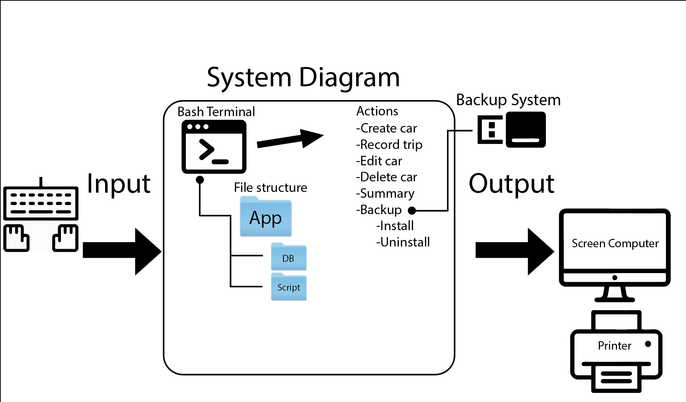
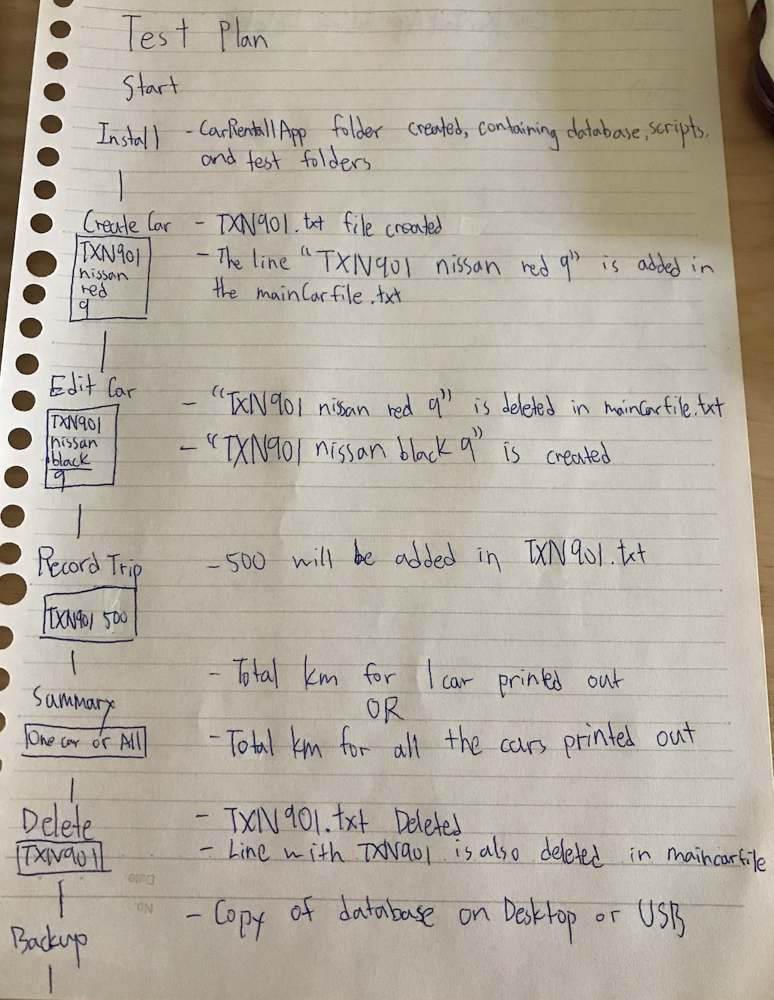
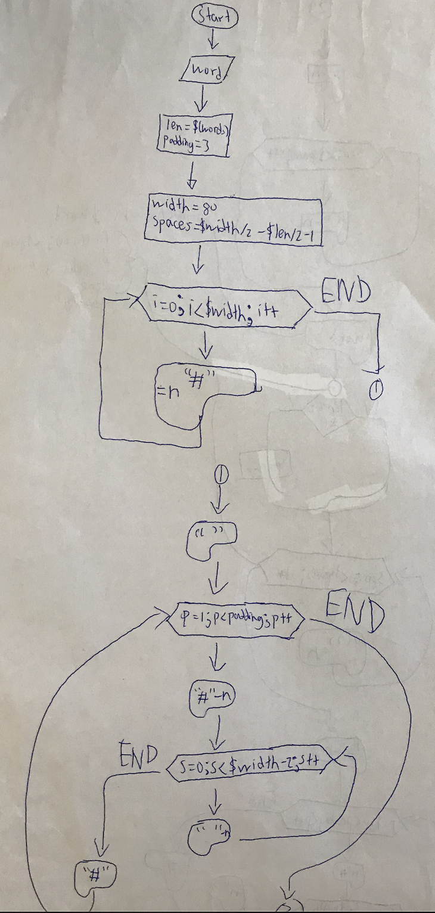
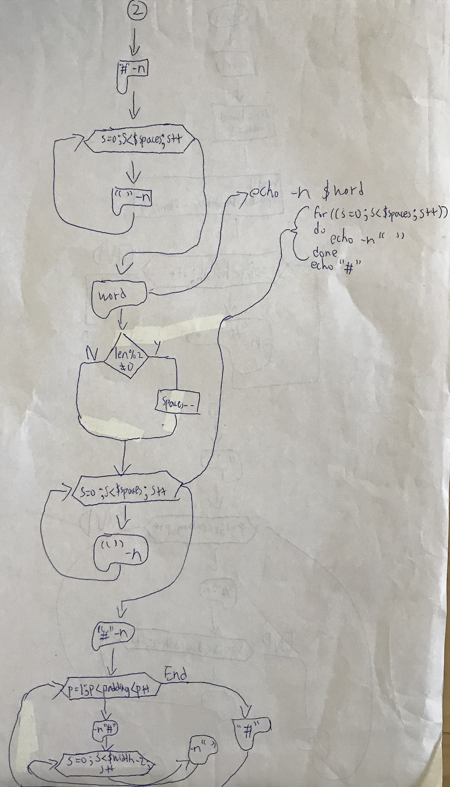
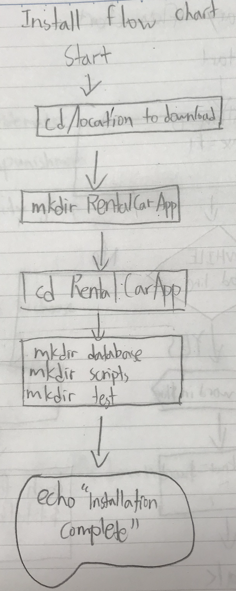
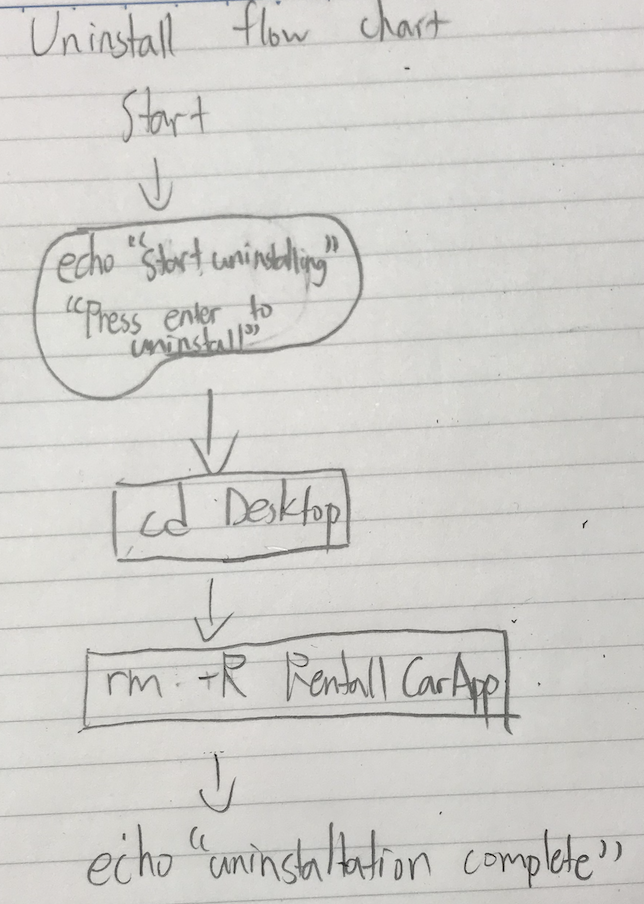

Car Rental Minimal App
===========================

A car rental management minimal app in Bash.

Contents
-----
  1. [Planning](#planning)
  1. [Design](#design)
  1. [Development](#development)
  1. [Evalution](#evaluation)

Planning
----------
### Definition of the problem
The car rental program can be divided into 8 parts which are to install the system, create documentation (user manual), create a car, record a trip, query the trip history of a car, edit, and delete the car, and being able to store the system (backup). For creating a car, the user has to input the license plate, car brand, model, and the maximum capacity in the system for it to recognize and confirm the vehicle. By querying and editing the trip and trip history of a car, the program has to require an easy manual for the user to input the distance of the trip. As for the backup system, it requires a script that copies all the files to the backed-up storage (ex: USB). 
### Proposed solution
I decided to use the bash program to create a series of scripts that can function for the car rental program, and the reason I used bash to create this program is because it is easier to create on the computer, and also because this is the language that I'm currently learning. The way this program works is to create the car profile, and after that the user has to input the details of the car (license plate, car brand, model, and the amount of passengers it can obtain). If the user wants to record the trip distances, they can simply just input the license plate of the car into the recording program and it'll show the total distance the car has traveled.
### Success Criteria
These are outcomes that can be measured
1. A car can be created and stored in the database
2. A car information can be edited
3. A car information can be deleted
4. A summary (total distance travel) of trips can be requested
5. A trip can be recorded for a given car
6. The user can easilly (name notation, documentation) understand the commands
7. Installation is **simple**, it does not require additional software, one step process
8. A basic working backup system is available

9. The application can be uninstalled

Design
---------
### First sketch of system

**Fig. 1** This diagram shows the main components of the minimal rental app.
It includes the input/output and main action

### Table for test plan



Development
--------
### Script for frame
Steps:
1. The user will input a word / phrase
2. Print out * around the word to make a nice looking frame
3. Print it out to the terminal
```.sh

word=$1
len=${#word}
padding=3

#length of the frame
width=80
(( spaces=$width/2-$len/2-1 )) 
# Print a whole line with symbol
for (( i=0; i<$width; i++ ))
do
	echo -n "#"
done
echo " " #this is for going down one line 

#prints the padding
for (( p=1; p<padding ; p++ ))
do
	echo -n "#"
	for (( s=0; s<$width-2; s++ ))
	do
		echo -n " "
	done
	echo "#"
done

#line for the word
echo -n "#"
for (( s=0;s<$spaces;s++ ))
do
	echo -n " "
done 

if [[ ($len%2 -eq 0) ]]; then
   (( padding=$padding-1 ))
fi

echo -n $word
for (( s=0;s<$spaces;s++ ))
do
        echo -n " "
done
echo "#"

#prints the padding
for (( p=1; p<padding ; p++ ))
do
        echo -n "#"
        for (( s=0; s<$width-2; s++ ))
        do
                echo -n " "
        done
        echo "#"
done

#print bottom frame
for (( i=0; i<$width; i++ ))
do
        echo -n "#"
done
echo " " #this is for going down one line
```
This flowchart shows the process behind the script that creates a frame around a string.





### Script for installation
The script below creates the folder structure for the application
Steps:
1. Move to Desktop
2. Create the CarRentalApp folder
3. Go inside the folder and install the required folders ( database, scripts, test ) 
The following script creates the app folder and inside it creates two more folders
```.sh
#!/bin/bash

#This progrsm creates the folder structure for the minimal rental app

echo "Starting installation"
echo "Installing in the desktop (default). Press enter"
read
cd ~/Desktop

#create app folder
mkdir RentalCarApp

cd RentalCarApp

mkdir database
mkdir scripts
echo "Installation complete successfully"
```
This script meets the requirement of the client for a simple installation, since the user only has to press enter to create the folders

This is the flow chart for creating the installation program

### Script for uninstallation
This script will delete the currently installed folders
Steps:
1. Move to Desktop
2. Echo if user presses enter, it will start uninstalling
3. If user presses enter, delete the folder with everything inside it
```.sh
#!/bin/bash

#This program deletes the currently installed folders

echo "Starting uninstalling"
echo "Press enter to uninstall"
read
cd ~/Desktop

#delete app folder

cd ~/Desktop
rm -R RentalCarApp

echo "uninstallation complete successfully"

```
The program works very easily, since the only thing that we have to use rm -r instead of rm. This is because you want to delete not only the folder but also everything that it contains, that is why we use -r.

This is the flow chart for the uninstall program

### problem solving
1. How to detect if a word's length is odd or even
```.sh
if [ $len%2 -eq 0 ]
```
2. How to create an uninstall program
```.sh
rm -R AppFolder
```
### Script for creating new car
This process involves the inputs _,_,_,_, and the outputs:
The following steps describe the algorithm
1. Get the inputs as arguments `$1,$2,$3,$4`
2. check number of arguments (4) `$#`
3. Store new car inside `maincarfile.txt`
4. Create file for recording trips as plate.txt
`echo "Lxq912 nissan 2000 8" >> maincarfile.txt`
`echo " " > plate.txt`

```.sh
#!/bin/bash

#This program creates a car given four arguments
#License Maker Model Passengers

if [ $# -ne 4 ]; then
	echo "Error with the number of arguments"
	echo "Enter License Maker Model Passengers"
	exit
fi

#number of arguments is correct, continue
license=$1
maker=$2
model=$3
pp=$4

#this creates a new line in the file maincarfile.txt inside CarRentalApp
echo "$license $maker $model $pp" >> ../Database/maincarfile.txt
echo "" > ../Database/$license.txt

bash frame2 "Installation Completed"

```

### Script for editing car
Steps:
1. Check if the user enters 4 arguments
2. Check if the car we want to edit exists
3. Find the line with the license in the maincarfile.txt
4. Rewrite the line with the arguments the user entered
```.sh
#This program edit the information of an exiting car in the
#maincarfile
#user enters [license place] [model] [red] [pp]

if [ $# -ne 4 ]; then
  echo "Error with the number of arguments"
  echo "Enter License Maker Model Passengers"
  exit
fi

license=$1
maker=$2
model=$3
pp=$4

cd ../Database

if [ ! -f "$license.txt" ]; then
  echo "File not found!"
fi

#find the line with the given car plate and delete it
sed -i '' "/^$license/d" maincarfile.txt
#add the new information
echo "$license $maker $model $pp" >> maincarfile.txt
cd ../scripts
bash frame2 "Car edited successfully"
```
I didn't know what was sed -i when i was coding this script, because i didn't know what the word in this command means. It looks very complicated but it is very efficient when coding the script helps to locate the line containing the word that you need to find. 

### Script for deleting car
Steps:
1. Check if the file exists
2. Check if only one argument is entered
3. Delete the license.txt file in database
4. Delete the line containing that license plate in maincarfile.txt
```.sh
#this program delete a car given one argument
#licenses 

if [ $# -ne 1 ]; then rm -rf 
	echo "error with the number of arguments"
	echo " enter license"
	exit 
fi 

#number of the arguments is correct, continue 
license=$1

#this deletes an existing file maincarfile.txt inside CarRentalApp 
cd ../Database
sed -i '' "/^$license/d" maincarfile.txt

cd ../scripts
bash frame2 "car deleted successufully"
```

### Script for summary for one car
Steps:
1. Check if only one argument is entered
2. Check if the car exists
3. Read the file, while adding all the kilometeres traveled in each line together
4. Print out in the terminal the total distance traveled of that car
```.sh
#This is an example script that solves the smaller problem for the action summary
#Read a txt file line by line
#Split a line by spaces
#Add the first word in the line

#checks number of arguments
if [ $# -ne 1 ]; then
  echo "Enter a license plate"
  exit
fi

License=$1
FILE="$License.txt"
cd ../Database
#Saves the total km
totalkm=0

#Reads the text file line by line
while read line
do
  #bash splits a line by spaces
  for km in $line
  do
    #add all the km
    ((totalkm=$km+$totalkm))
    break
  done
done < $FILE

cd ../scripts
#4 show very nicely of the total km traveled
bash frame2 "Total km traveled is $totalkm"
```
### Script for summary for all
Steps:
1. Read the maincarfile.txt to find all of the car names, so that we can know all the license.txt files
2. Redo what we did in the summary.sh file
3. Print out the name of the plate, and all the trips of that car to the user ( for every car )
4. Print out the sum of the distance traveled
```.sh
#!/bin/bash
# This program gives the total distance traveled of all the cars in the db folder
cd ~/Desktop/ComSci/CarRentalApp/Database
s=0
while read LINE 
do
  for WORD in $LINE
    do
      echo "Distance traveled of $WORD: "
      while read line
      do
         for word1 in $line
         do
                echo -n "$word1 "
               ((s=s+word1))
                break
        done
      done < $WORD.txt
      echo
      break
    done
done < maincarfile.txt
echo "Total: $s km"
```
### Script for recording a trip
1. Get the arguments (2) and check
2. check that the car exist (check if a file exists in bash)
* test license.txt
* -f license.txt
3. add a new line to the file license.txt
4. End

*line to = >>

```.sh
#This program records a trip in the file of a car provided
if [ $# -ne 4 ]; then
	echo "Error with the number of arguments"
	echo "Enter license distance date in date out"
	exit
elif [ ! -f "$1.txt" ]; then
	echo "File not found!"
	exit
else 
echo "$2 $3 $4" >> $1.txt
cd ../scripts
bash frame2 "Trip recorded successfully"
fi
```

### Developing Backup Files
There are two methods for backing up the data, one being copying the database to another folder on the desktop, and another being copying the files into a USB stick

#### Option 1 (Desktop)
This code backs up the data to a seperate folder on the desktop
```.sh
#!/bin/bash
# This program creates a backup of the database folder in the app folder

# Starting
echo "Backup starting"

# Navigate to the desktop to create a new folder (backup/)
cd ~/desktop/
# If theres already a folder called "backup", it is removed
rm -r backup
mkdir backup
# Creats subfolder (backup/dataBase/)
cd backup
mkdir dataBase

# Copies all (*) the files from the dataBase folder 
# to the new folder (backup/) and subfolder (backup/dataBase/)
cp ~/desktop/RentalCarApp/dataBase/* ~/desktop/backup/dataBase/
```

#### Option 2 (USB)
This code is for backing up to a USB
```.sh
# Save to a usb stick

echo -n "What is your USB stick called? "
read usbName

cd /Volumes/%usbName/
# If theres already a folder called "backup", it is removed
rm -r backup
mkdir backup
# Creats subfolder (backup/dataBase/)
cd backup
mkdir dataBase

# Copy files to USB stick
cp ~/desktop/RentalCarApp/dataBase/* /Volumes/$usbName/backup/dataBase/
```

### Developing Help files
We will be using man pages to create a help file, almost all UNIX like oses comes preinstalled with man pages. It is a document processing system developed by AT&T for the Unix operating system.
Below is the code created to explain the create.sh action:
```.sh
.TH man 6 "29 Oct 2019" "1.0" "create man page"
.SH NAME
create \- Creates a new car
.SH SYNOPSIS
bash create [license] [model] [color] [passengers]
.SH DESCRIPTION
create is a bash program that allows to create a new car in the database
.SH AUTHOR
Irvin Fang
```
Evaluation
-----------

### Evaluating the success criteria

|    SUCCESS CRITERIA                                                     |   MET?  |
| ----------------------------------------------------------------------- | ------- |
| A car can be created and stored in database				  |   Yes   |
|									  |	    |
| A car infromation can be edited				          |   Yes   |
|									  |         |
| A car can be deleted from the database			          |   Yes   |
|									  |         |
| User can easily understand the commands (name notation, documentation)  |   Yes   |
|									  |	    |
| Trips can be recorded and stored for an existing car                    |   Yes   |         
|  							                  |         |
|									  |         |
| A summary (total/average distance traveled) can be generated		  |   Yes   |
| for a particular car				                          |         |
|									  |         |
| The installation is simple-> one step process                           |   Yes   |
|									  |         |
| A basic backup system is available				          |   Yes   |
|									  |         |
| The application can be uninstalled					  |   Yes   |
|									  |         |
| User-skill independent						  |   Yes   |
|									  |         |
| A basic permanent storage system and backup				  |   Yes   |

### Test 1:
The **first** step is to check for the file
```.sh
#!/bin/bash

#This file checks if the action create successfully addsa new car.

#step 1: navigate to the folder containing the create.sh file
cd ../scripts/
if [ -f "create" ]; then
        echo "File exists, test will start now"
else
        echo "File create.sh doesn't exist. Test Failed"
fi
```
This file checks all the criteria.
The option -f in the if function checks for a file in the working folder


The **Second** step is to use the create script to create a new car, in this example, I will be using TXM901 Nissan red 9 as an example. bash create.sh TXM901 Nissan red 9

The **Third** step is to check if the .txt file was created inside the database folder with the license number
```.sh
#step 2: Use the create script to record a new car TXM901 nissan red 9
bash create TXM901 nissan red 9

#step 3: check that a txt file was created inside the database folder with
#the license number
cd ../Database
if [ -f "TXM901.txt" ]; then
        echo "Test One: File with the license place created successfully. passe$
else
        echo "Test one: file with license number not found: failing"
fi
```
The **Fourth** step is to check if the last line of the mainCarFile.txt is "TXM901 nissan red 9"
```.sh
#Step 4: Check if the last line of the mainCarFile.txt is "TXM901 nissan red 9"
# Saves the last line of mainCarFile.txt into the variable lastline
lastline=$( tail -n 1 mainCarFile.txt )

# Checks if the last line is equal to the test case
if [ "$lastline" == "TXM901 nissan red 9" ]; then
    echo "Test completed successfully. File created, and information added to mainCarFile.txt"
else
    echo "Test failed. No TXM901 in mainCarFile.txt"
fi
```
*lastline=$( tail -n 1 mainCarFile.txt ) is used to save and store the last line of any text file into a string.

This resembles to a type of dynamic testing
This is called dynamic testing because we executed the programmed code with a given test, which means the testing took place while the system was running.

This testing is also a type of alpha testing, meaning only the internal employees and developers of an organization tested the software, compared to beta testing where external clients and end users test.

Lastly, we also tested the code using the white-box method. We used the information and knowledge available about the internals of the system to understand what was wrong and to fix various bugs.

This was also a type of automatic testing, at least in the program we created. The new testing script will be able to control the test executions and then compare the actual results with the predicted or expected results.

